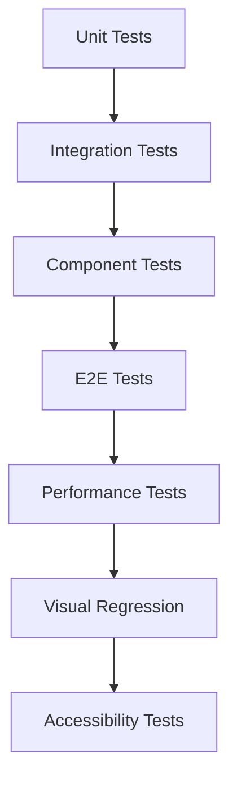

# DAGGER Test Harness Implementation Plan

## Executive Summary

DAGGER v0.5.0 currently has a **solid foundation** with 29+ test files using Vitest + React Testing Library, but lacks comprehensive coverage for critical production scenarios. This plan establishes a **robust, production-grade test harness** that ensures reliability across the entire knowledge cartography platform.

## Current State Assessment

### ✅ **Existing Strengths**
- **Framework**: Vitest with jsdom environment (fast, modern)
- **Testing Library**: React Testing Library for component testing
- **Coverage Areas**: Core services, components, and prompt registry
- **Configuration**: Clean setup with `setupTests.js` and Vite integration
- **Test Commands**: `npm test` and `npm test:watch` working

### ❌ **Critical Gaps**
- No end-to-end testing for user workflows
- Limited API integration testing (mocked only)
- Missing performance benchmarks for graph operations
- No visual regression testing for UI components
- Insufficient coverage for error scenarios
- No load testing for conversation networks
- Missing accessibility testing automation

## Test Harness Architecture

### 1. **Multi-Layer Testing Strategy**



### 2. **Test Categories & Implementation**

#### **Layer 1: Enhanced Unit Testing**
- **Target**: Individual functions, utilities, services
- **Framework**: Vitest (existing)
- **Coverage Goal**: 95% for core business logic

**Priority Areas:**
- Graph algorithms (`GraphModel`, `ConversationChainBuilder`)
- XML prompt parsing and validation
- Token economics calculations
- Message formatting logic
- Branch/merge operations

#### **Layer 2: Integration Testing**
- **Target**: Service interactions, API flows
- **Framework**: Vitest with MSW (Mock Service Worker)
- **Coverage**: API contracts, data flows, error handling

**Key Test Scenarios:**
- Claude API integration with real-world responses
- Conversation branching with complex histories
- Merge operations with hierarchical validation
- Temperature/model switching workflows
- Session management and API key handling

#### **Layer 3: Component Testing**
- **Target**: React components in isolation
- **Framework**: React Testing Library + Vitest
- **Coverage**: User interactions, state management, visual feedback

**Enhanced Coverage:**
- `GraphView` drag-to-merge interactions
- `DaggerInput` with various prompt personalities
- Temperature control with real-time feedback
- Welcome screen animations and click effects
- Error boundary behaviors

#### **Layer 4: End-to-End Testing**
- **Framework**: Playwright (recommended for DAGGER)
- **Target**: Complete user workflows
- **Environment**: Production-like Vercel deployment

**Critical User Journeys:**
```gherkin
Feature: Core Conversation Workflow
  Scenario: User creates branched conversation
    Given user enters API key
    When user selects "Navigator" personality
    And user asks initial question
    And user creates branch from response
    And user merges branches
    Then conversation graph shows merged result
    And token usage is tracked accurately
```

#### **Layer 5: Performance Testing**
- **Framework**: Custom benchmarks with Vitest
- **Target**: Graph operations, rendering, memory usage

**Benchmarks:**
- Graph rendering with 100+ nodes
- Conversation history loading times
- Memory usage with large conversation networks
- API response time tracking
- Bundle size monitoring

#### **Layer 6: Visual Regression Testing**
- **Framework**: Playwright + Percy/Chromatic
- **Target**: UI consistency across updates

**Scenarios:**
- Welcome screen layouts across devices
- Graph visualization consistency
- Animation sequences (click effects, progress bars)
- Responsive design breakpoints
- Dark/light mode variations (future)

#### **Layer 7: Accessibility Testing**
- **Framework**: axe-core integration
- **Target**: WCAG 2.1 AA compliance

**Automated Checks:**
- Keyboard navigation workflows
- Screen reader compatibility
- Color contrast ratios
- Focus management in graph interactions
- ARIA labels for complex UI elements

## Implementation Roadmap

### **Phase 1: Foundation (Week 1-2)**
1. **Enhanced Unit Testing**
   - Expand existing test coverage to 95%
   - Add performance benchmarks for core algorithms
   - Implement comprehensive error scenario testing

2. **Integration Test Framework**
   - Set up MSW for API mocking
   - Create test fixtures for various conversation scenarios
   - Implement Claude API contract testing

### **Phase 2: User Experience (Week 3-4)**
1. **E2E Testing Setup**
   - Install and configure Playwright
   - Create test environments (staging + production)
   - Implement critical user journey tests

2. **Component Enhancement**
   - Comprehensive React Testing Library coverage
   - User interaction simulation
   - State management validation

### **Phase 3: Quality Assurance (Week 5-6)**
1. **Visual & Accessibility**
   - Set up visual regression testing
   - Implement automated a11y checks
   - Cross-browser compatibility testing

2. **Performance Monitoring**
   - Real-world performance benchmarks
   - Memory leak detection
   - Bundle size optimization tracking

## Test Data Management

### **Fixtures & Mocks**
```
tests/
├── fixtures/
│   ├── conversations/
│   │   ├── simple-qa.json
│   │   ├── complex-branched.json
│   │   └── merged-conversations.json
│   ├── api-responses/
│   │   ├── claude-success.json
│   │   ├── claude-errors.json
│   │   └── rate-limits.json
│   └── prompts/
│       ├── test-personalities.xml
│       └── invalid-prompts.xml
├── mocks/
│   ├── claude-api.js
│   ├── graph-operations.js
│   └── browser-storage.js
└── utils/
    ├── test-helpers.js
    ├── assertion-matchers.js
    └── setup-teardown.js
```

## Configuration & Tooling

### **Enhanced Vite Configuration**
```javascript
// vite.config.js additions
export default defineConfig({
  test: {
    globals: true,
    environment: 'jsdom',
    setupFiles: ['./src/setupTests.js'],
    coverage: {
      reporter: ['text', 'json', 'html'],
      threshold: {
        global: {
          branches: 90,
          functions: 95,
          lines: 95,
          statements: 95
        }
      }
    },
    benchmark: {
      includeSource: ['src/**/*.{js,ts,jsx,tsx}']
    }
  }
})
```

### **CI/CD Integration**
```yaml
# .github/workflows/test.yml
name: Test Harness
on: [push, pull_request]
jobs:
  test:
    runs-on: ubuntu-latest
    steps:
      - uses: actions/checkout@v4
      - run: npm ci
      - run: npm run test:coverage
      - run: npm run test:e2e
      - run: npm run test:performance
      - run: npm run test:accessibility
```

## Quality Gates & Metrics

### **Automated Quality Checks**
- ✅ **95%+ code coverage** for business logic
- ✅ **Zero accessibility violations** in critical paths
- ✅ **<2s load time** for initial page render
- ✅ **<500ms response time** for graph operations
- ✅ **Zero visual regressions** in UI components
- ✅ **100% pass rate** on critical user journeys

### **Monitoring & Alerting**
- Real-time test results dashboard
- Performance regression alerts
- Accessibility compliance monitoring
- Visual diff notifications
- Test flakiness tracking

## Risk Mitigation

### **High-Risk Areas**
1. **API Integration**: Claude API changes or rate limits
2. **Graph Performance**: Large conversation networks
3. **Browser Compatibility**: Cross-platform graph rendering
4. **Mobile Experience**: Touch interactions and responsive design

### **Mitigation Strategies**
- Comprehensive API contract testing
- Performance benchmarks with realistic data sizes
- Cross-browser E2E testing matrix
- Mobile-specific test scenarios

## Success Criteria

### **Short-term (Month 1)**
- 95% unit test coverage achieved
- E2E tests covering all critical workflows
- Integration tests for all API interactions
- Performance benchmarks established

### **Long-term (Month 3)**
- Zero production bugs related to untested scenarios
- Sub-2s page load times maintained
- 100% accessibility compliance
- Automated quality gates preventing regressions

## Resource Requirements

### **Tools & Dependencies**
- Playwright for E2E testing (~2MB)
- MSW for API mocking (~500KB)
- axe-core for accessibility (~1MB)
- Percy/Chromatic for visual testing (external)

### **Development Time**
- **Phase 1**: 20-30 hours (foundation)
- **Phase 2**: 25-35 hours (user experience)
- **Phase 3**: 15-25 hours (quality assurance)
- **Total**: 60-90 hours for complete implementation

---

## Next Steps

1. **Immediate**: Review and approve this plan
2. **Week 1**: Begin Phase 1 implementation
3. **Ongoing**: Integrate testing into development workflow
4. **Monthly**: Review metrics and adjust coverage goals

This test harness will transform DAGGER from a well-functioning prototype into a **production-bulletproof knowledge cartography platform** with enterprise-grade reliability and quality assurance.